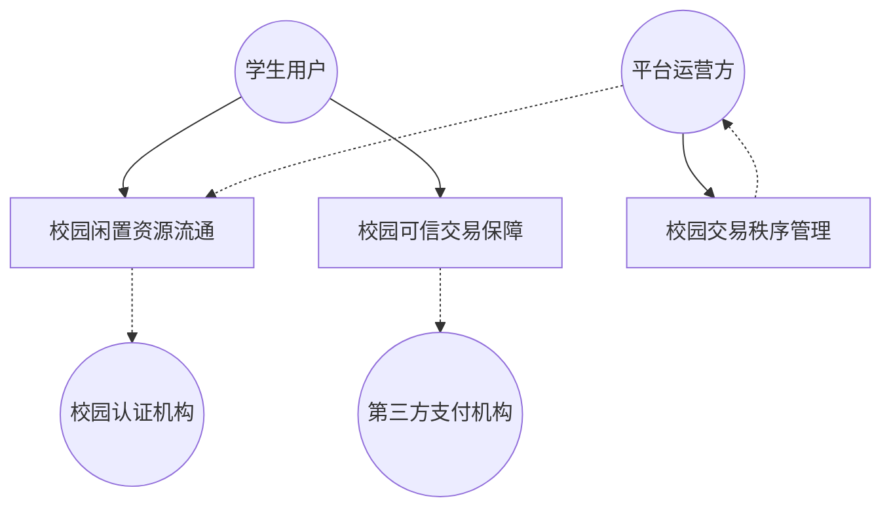

```mermaid
graph TD
    %% 定义参与者
    Student((学生用户))
    Admin((平台运营方))
    AuthAgency((校园认证机构))
    PaymentGateway((第三方支付机构))

    %% 定义用例
    UC1[校园闲置资源流通]
    UC2[校园可信交易保障]
    UC3[校园交易秩序管理]

    %% 关联关系
    Student --> UC1
    Student --> UC2
    Admin --> UC3
    Admin -.-> UC1
    
    UC1 -.-> AuthAgency
    UC2 -.-> PaymentGateway
    UC3 -.-> Admin
```

